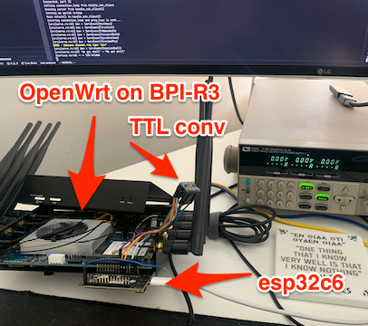
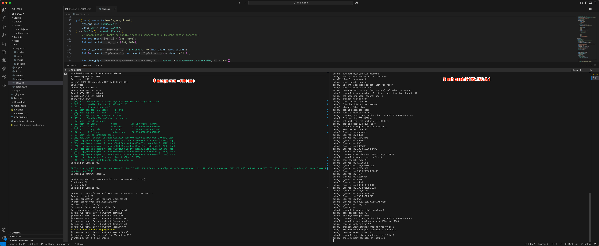
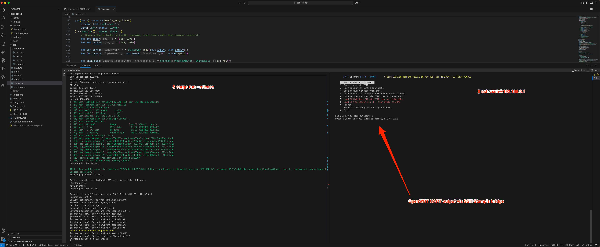

# SSH Stamp

Sponsored by:

![nlnet_zero_commons][nlnet_zero_commons]

# ⚠️ WARNING: Pre-alpha PoC quality, DO NOT use in production. Currently contains highly unsafe business logic auth issues (both password and key management handlers need to be fixed). 

# ⚠️ WARNING: Do not file CVEs reports since deficiencies are very much known at this point in time and they'll be worked on soon as part of [this NLNet SSH-Stamp research and development grant][nlnet-grant] ;)

Expect panics, lost bytes on the UART and other tricky UX issues, we are working on it, pull-requests are accepted too!

## Description

Your everyday SSH secured serial access.

The **SSH Stamp** is a secure wireless to UART bridge
implemented in Rust (no_std, no_alloc and no_unsafe whenever possible)
with simplicity and robustness as its main design tenets.

The firmware runs on a microcontroller running Secure SHell Protocol
(RFC 4253 and related IETF standards series). This firmware can be
used for multiple purposes, conveniently avoiding physical
tethering and securely tunneling traffic via SSH by default: easily
add telemetry to a (moving) robot, monitor and operate any (domestic)
appliance remotely, conduct remote cybersecurity audits on
network gear of a company, reverse engineer hardware and software for
right to repair purposes, just to name a few examples.

A "low level to SSH Swiss army knife".

# Building

Rust versions are controlled via `rust-toolchain.toml` and the equivalent defined on the CI workflow.

On a fresh system the following should be enough to build and run on an ESP32-C6 dev board.

```
rustup toolchain install stable --component rust-src
rustup target add riscv32imac-unknown-none-elf
cargo build --release
```

Running on the target:

```
cargo install espflash
cargo run --release
```

# Example usecases

The following depicts a typical OpenWrt router with a (prototype) SSH Stamp connected to its UART. After ssh-ing into the SSH Stamp, one can interact with the router's UART "off band", to i.e:

1. Recover from OpenWrt not booting without needing to open up the case and connect a wired TTL2USB converter. A simple SSH-based <acronym title="Board Management Controller">BMC</acronym>.
2. Capture kernel panics during your router's (ab)normal operation. I.e: [to debug a buggy wireless driver][openwrt_mediatek_no_monitor].
3. Re-provision the whole OpenWrt installation without having to physically unmount the device from its place, all from your wireless SSH shell comfort.

Here are some PoC shots:





# Generate SBOM

```
cargo install cargo-cyclonedx
cargo cyclonedx -f json --manifest-path ./docs/
```

[nlnet-grant]: https://nlnet.nl/project/SSH-Stamp/
[openwrt_mediatek_no_monitor]: https://github.com/openwrt/openwrt/issues/16279
[nlnet_zero_commons]: ./docs/nlnet/zero_commons_logo.svg
